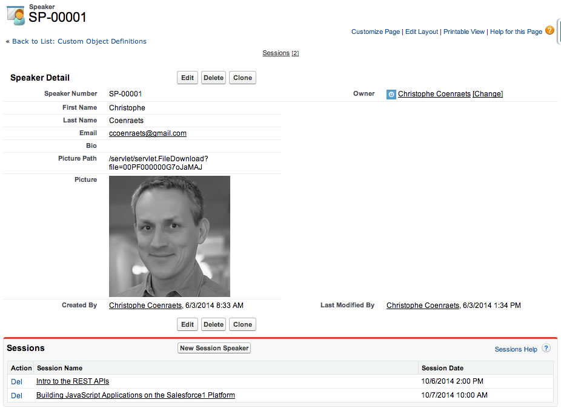

In this module, you enhance the Visualforce page you built in module 7: you create a controller extension that allows users to upload speaker pictures.



### Step 1: Create a Controller extension

In this step, you experiment with the mechanics of a controller extension. You create a simple controller extension that exposes an **increment()** method and a **counter** property. When you click the Increment button in the SpeakerForm page, the extension's increment() method increments the counter property whose new value is automatically displayed in the page. In the next step, you make SpeakerControllerExtension a lot more useful by adding code to support the upload of speaker pictures.

1. In the Developer Console, select **File** > **New** > **Apex Class**, specify **SpeakerControllerExtension** as the class name and click **OK**

1. Implement the class as follows:

    ```
    public class SpeakerControllerExtension {
    
        public Integer counter {get; set;}
        
        private final Speaker__c speaker;
        private ApexPages.StandardController stdController;
        
        public SpeakerControllerExtension(ApexPages.StandardController stdController) {
            this.speaker = (Speaker__c)stdController.getRecord();
            this.stdController = stdController;
            counter = 0;
        }
        
        public void increment() {
            counter++;
        }
    
    }
    ```

1. In the Developer Console, open the SpeakerForm page, and add the controller extension to the page definition:

    ```
    <apex:page standardController="Speaker__c" extensions="SpeakerControllerExtension">
    ```

1. Add an Increment button (right after the Save button):

    ```
    <apex:commandButton action="{!increment}" value="Increment"/>
    ```

1. Display the counter (right after &lt;/apex:pageBlock>):

    ```
    {!counter}
    ```

1. Save the file

1. Test the application
  - Click the Speakers tab, select a speaker, and click **Edit**
  - Click the Increment button several times and watch the counter value displayed at the bottom of the page


### Step 2: Extend the Data Model

In this step, you add two fields to the Speaker object: **Picture_Path** to store the location of the picture on the server, and **Picture**, a Formula field used to display the image in the Visualforce page.

1. In **Setup**, select **Build** > **Create** > **Objects**, and click the **Speaker** link

1. In the **Custom Fields & Relationships** section, click **New**, and create a **Picture_Path** field defined as follows:
  - Data Type: **Text**
  - Field Label: **Picture Path**
  - Length: **255**
  - Field Name: **Picture_Path**

  Click **Next**, **Next**, **Save & New**

1. Create a **Picture** field defined as follows:
  - Data Type: **Formula**
  - Field Label: **Picture**
  - Field Name: **Picture**
  - Formula Return Type: **Text**
  - Formula: **IMAGE(Picture&#95;Path__c, '')**

  Click **Next**, **Next**, **Save**


### Step 3: Add Image Upload Support

1. In the Developer Console, open **SpeakerControllerExtension**

1. Remove the counter variable declaration, the counter variable initialization in the class constructor, and the increment() method definition

1. Declare the following variables (right before the **speaker** variable declaration):

  ```
  public blob picture { get; set; }
  public String errorMessage { get; set; }
  ```

1. Declare a **save()** method implemented as follows to override the standard controller's default behavior (right after the constructor method):

    ```
    public PageReference save() {
        errorMessage = '';
        try {
            upsert speaker;
            if (picture != null) {
                Attachment attachment = new Attachment();
                attachment.body = picture;
                attachment.name = 'speaker_' + speaker.id + '.jpg';
                attachment.parentid = speaker.id;
                attachment.ContentType = 'application/jpg';
                insert attachment;
                speaker.Picture_Path__c = '/servlet/servlet.FileDownload?file=' 
                                          + attachment.id;
                update speaker;
            }
            return new ApexPages.StandardController(speaker).view();
        } catch(System.Exception ex) {
            errorMessage = ex.getMessage();
            return null;
        }
    }
    ```

1. Save the file

1. In the Developer Console, open the SpeakerForm page

1. Remove the Increment button

1. Add an inputFile (right after the Email inputField):

    ```
    <apex:inputFile value="{!picture}" accept="image/*" />
    ```

1. Instead of the counter, display the potential errorMessage right after &lt;/apex:pageBlock>

    ```
    {!errorMessage}
    ```

1. Save the file

### Step 4: Test the Application

1. Click the Speakers tab

1. Click **New** to add a speaker

1. Enter the speaker first name, last name and email

1. Click the **Choose File** button and select a jpg file on your file system

1. Click the **Save** button: you should see the image on the speaker's details page
