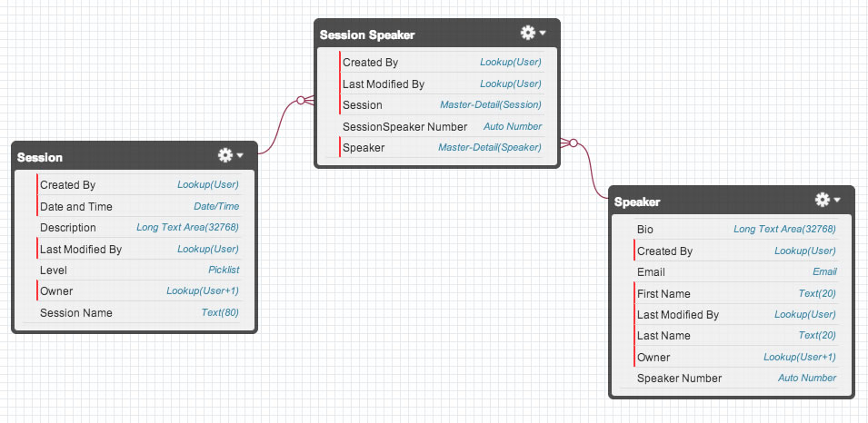

In this module, you create the custom objects that make up the data model for the conference application.

### Step 1: Create the Conference Session Object

1. Login into your Developer Edition account

1. Click the **Setup** link (upper right corner)

  

1. In the left navigation, select **Build** > **Create** > **Objects**

  

1. Click **New Custom Object**, and define the Session object as follows (accept the default values for the properties that are not mentioned below):
  - Label: **Session**
  - Plural Label: **Sessions**
  - Object Name: **Session**
  - Record Name: **Session Name**
  - Data Type: **Text**

  

1. Click **Save**

1. In the **Custom Fields & Relationships** section, click **New**

  

1. Create a **Session Date** field defined as follows:
  - Data Type: **Date/Time**
  - Field Label: **Session Date**
  - Field Name: **Session_Date**

  

  Click **Next**, **Next**, **Save & New**

1. Create a **Description** field defined as follows:
  - Data Type: **Text Area (Long)**
  - Field Label: **Description**
  - Field Name: **Description**

  Click **Next**, **Next**, **Save & New**

1. Create a **Level** field defined as follows:
  - Data Type: **Picklist**
  - Field Label: **Level**
  - Values: **Beginner**, **Intermediate**, **Advanced** (specify each value on its own row)
  - Field Name: **Level**

  Click **Next**, **Next**, **Save**

### Step 2: Create the Speaker Object

1. In Setup mode, select **Build** > **Create** > **Objects**

1. Click **New Custom Object**, and define the Speaker object as follows (accept the default values for the properties that are not mentioned below):
  - Label: **Speaker**
  - Plural Label: **Speakers**
  - Object Name: **Speaker**
  - Record Name: **Speaker Number**
  - Data Type: **Auto Number**
  - Display Format: **SP-{00000}**
  - Starting Number: **1**

1. Click **Save**

1. In the **Custom Fields & Relationships** section, click **New**, and create a **First Name** field defined as follows:
  - Data Type: **Text**
  - Field Label: **First Name**
  - Length: **30**
  - Field Name: **First_Name**

  Click **Next**, **Next**, **Save & New**

1. Create a **Last Name** field defined as follows:
  - Data Type: **Text**
  - Field Label: **Last Name**
  - Length: **30**
  - Field Name: **Last_Name**

  Click **Next**, **Next**, **Save & New**

1. Create an **Email** field defined as follows:
  - Data Type: **Email**
  - Field Label: **Email**
  - Field Name: **Email**

  Click **Next**, **Next**, **Save & New**

1. Create a **Bio** field defined as follows:
  - Data Type: **Text Area (Long)**
  - Field Label: **Bio**
  - Field Name: **Bio**

  Click **Next**, **Next**, **Save**

### Step 3: Create the Session_Speaker Junction Object

The Session_Speaker object is used to model the many-to-many relationship between Session and Speaker: a session can have one or many speakers, and a speaker can have one or many sessions.

1. In Setup mode, select **Build** > **Create** > **Objects**

1. Click **New Custom Object**, and define the **Session_Speaker** object as follows:
  - Label: **Session Speaker**
  - Plural Label: **Session Speakers**
  - Object Name: **Session_Speaker**
  - Record Name: **Session Speaker Number**
  - Data Type: **Auto Number**
  - Display Format: **SESP-{00000}**
  - Starting Number: **1**

1. Click **Save**

1. In the **Custom Fields & Relationships** section, click **New**, and create a **Session** field defined as follows:
  - Data Type: **Master-Detail Relationship**
  - Related To: **Session**
  - Field Label: **Session**
  - Field Name: **Session**

  Click **Next**, **Next**, **Next**, set the Related List Label to "**Speakers**" and click **Save & New**

1. Create a **Speaker** field defined as follows:
  - Data Type: **Master-Detail Relationship**
  - Related To: **Speaker**
  - Field Label: **Speaker**
  - Field Name: **Speaker**

  Click **Next**, **Next**, **Next**, set the Related List Label to "**Sessions**" and click **Save**

### Step 4: Examine the Data Model in Schema Builder

1. In Setup mode, search for "**schema**" in the left navigation, and click **Schema Builder**

  

1. Click **Clear All**

1. Check **Session**, **Speaker**, and **Session Speaker**

1. Examine the MyConference data model. Rearrange the objects as needed.

<a href="Creating-a-Developer-Edition-Account.html" class="btn btn-default"><i class="glyphicon glyphicon-chevron-left"></i> Previous</a>
<a href="Creating-the-Application.html" class="btn btn-default pull-right">Next <i class="glyphicon glyphicon-chevron-right"></i></a>

